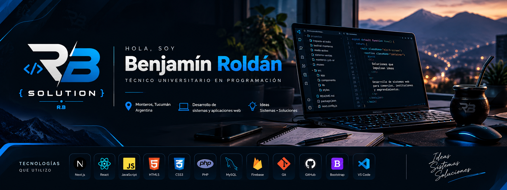

  

<h1 align="center">👋 Hola, soy Benjamín Roldán</h1>

<h3 align="center">
🎓 Técnico Universitario en Programación | 💻 Desarrollo de Software | 🚀 RB Solution
</h3>

  📍 Monteros, Tucumán, Argentina

  

---

## 👨‍💻 Sobre mí

Soy **Técnico Universitario en Programación** y me dedico al desarrollo de
**sistemas y aplicaciones web**.

Me gusta crear soluciones para comercios, emprendimientos e instituciones,
buscando simplificar tareas y resolver problemas reales mediante software.

🚀 Actualmente desarrollo proyectos bajo **RB Solution**.

---

## 🛠️ Tecnologías que utilizo

---

## 🚀 Proyectos destacados

### 🏔️ Trepada al Indio

Plataforma web desarrollada para la gestión e inscripción del evento
**Trepada al Indio – Monteros, Tucumán**.

`Next.js` `CSS` `MySQL`

---

### 🎟️ Festival Monteros de la Patria

Sistema para la **venta, generación y validación de entradas mediante códigos QR**.

Incluye herramientas para gestión de ventas, control de accesos y estadísticas.

`Next.js` `MySQL` `QR`

---

### 🛒 Sistemas de Gestión Comercial

Desarrollo de sistemas orientados a comercios con:

- Gestión de ventas
- Control de stock
- Clientes y proveedores
- Caja
- Reportes
- Catálogo web
- Integración con medios de pago

`Next.js` `PHP` `MySQL` `Firebase`

---

### 💪 Modo Activo

Aplicación web para gestión de gimnasio.

Permite administrar rutinas, alumnos, pagos y asistencias.

`PWA` `Firebase` `JavaScript`

---

## 📊 Estadísticas de GitHub

---

## 🎯 Actualmente

- 🚀 Desarrollando proyectos para **RB Solution**
- 💻 Mejorando mis conocimientos en desarrollo web
- 🗄️ Trabajando con bases de datos MySQL y Firebase
- ⚙️ Creando sistemas orientados a problemas reales
- 📚 Aprendiendo nuevas tecnologías y herramientas

---

## 🌐 RB Solution

**Desarrollo de software y soluciones digitales.**

🌎 https://rbsolution.com.ar

---

<h3 align="center">🤝 Conectemos</h3>

---

💻 <i>Ideas, sistemas y soluciones.</i> 🚀

